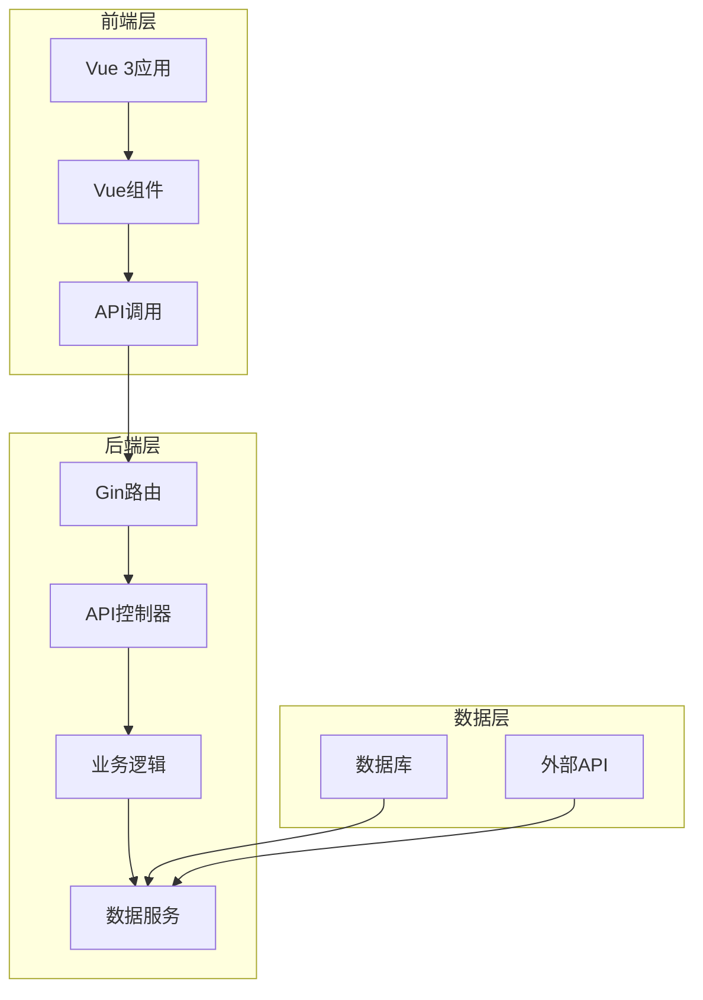

# go-stock Web版架构设计方案

## 1. 技术栈选择

### 后端技术栈
- **Go语言**：复用现有后端代码
- **Gin框架**：高性能Web框架，用于构建API接口
- **GORM**：数据库ORM，复用现有数据库操作
- **JWT**：用户认证（可选）
- **CORS**：跨域支持

### 前端技术栈
- **Vue 3**：复用现有前端代码
- **Vue Router**：路由管理
- **NaiveUI**：UI组件库，复用现有组件
- **Axios**：HTTP客户端，替代WailsJS
- **ECharts**：图表库，复用现有图表功能

## 2. 架构设计

### 2.1 整体架构



### 2.2 目录结构

```
web/
├── backend/          # Web后端代码
│   ├── api/          # API控制器
│   ├── middleware/   # 中间件
│   ├── services/     # 业务逻辑
│   └── main.go       # Web后端入口
├── frontend/         # Web前端代码
│   ├── src/          # 源代码
│   │   ├── api/      # API调用封装
│   │   ├── components/ # 组件
│   │   ├── router/   # 路由
│   │   └── main.js   # 前端入口
│   ├── public/       # 静态资源
│   ├── index.html    # HTML模板
│   ├── package.json  # 依赖配置
│   └── vite.config.js # Vite配置
├── go.mod            # Go模块依赖
├── go.sum            # 依赖校验
└── build.sh          # 构建脚本
```

## 3. API接口设计

### 3.1 核心API接口

| API路径 | 方法 | 功能描述 | 对应桌面版功能 |
|---------|------|----------|----------------|
| `/api/stock/follow` | POST | 关注股票 | `App.Follow` |
| `/api/stock/unfollow` | POST | 取消关注股票 | `App.UnFollow` |
| `/api/stock/follow-list` | GET | 获取关注股票列表 | `App.GetFollowList` |
| `/api/stock/list` | GET | 搜索股票 | `App.GetStockList` |
| `/api/stock/info` | GET | 获取股票信息 | `App.Greet` |
| `/api/stock/cost` | POST | 设置成本价和持仓量 | `App.SetCostPriceAndVolume` |
| `/api/stock/alarm` | POST | 设置报警阈值 | `App.SetAlarmChangePercent` |
| `/api/stock/sort` | POST | 设置股票排序 | `App.SetStockSort` |
| `/api/ai/chat` | POST | AI聊天 | `App.NewChatStream` |
| `/api/ai/result` | GET | 获取AI分析结果 | `App.GetAIResponseResult` |
| `/api/ai/save` | POST | 保存AI分析结果 | `App.SaveAIResponseResult` |
| `/api/config` | GET | 获取配置 | `App.GetConfig` |
| `/api/config` | POST | 更新配置 | `App.UpdateConfig` |
| `/api/fund/list` | GET | 搜索基金 | `App.GetfundList` |
| `/api/fund/follow` | POST | 关注基金 | `App.FollowFund` |
| `/api/fund/unfollow` | POST | 取消关注基金 | `App.UnFollowFund` |
| `/api/fund/followed` | GET | 获取关注基金列表 | `App.GetFollowedFund` |
| `/api/prompt/list` | GET | 获取提示词模板 | `App.GetPromptTemplates` |
| `/api/prompt/add` | POST | 添加提示词模板 | `App.AddPrompt` |
| `/api/prompt/delete` | DELETE | 删除提示词模板 | `App.DelPrompt` |
| `/api/group/list` | GET | 获取分组列表 | `App.GetGroupList` |
| `/api/group/add` | POST | 添加分组 | `App.AddGroup` |
| `/api/group/sort` | POST | 更新分组排序 | `App.UpdateGroupSort` |
| `/api/group/stock` | GET | 获取分组股票 | `App.GetGroupStockList` |
| `/api/group/stock/add` | POST | 添加股票到分组 | `App.AddStockGroup` |

### 3.2 API响应格式

```json
{
  "code": 200,
  "message": "success",
  "data": {}
}
```

## 4. 前端设计

### 4.1 页面结构

复用现有桌面版的页面结构，包括：
- 股票列表页
- 基金列表页
- 市场资讯页
- AI分析页
- 研究报告页
- 设置页

### 4.2 数据流

1. 前端通过Axios调用后端API
2. 后端处理请求并返回数据
3. 前端接收数据并更新界面
4. 实时数据通过定时请求获取

### 4.3 状态管理

- 使用Vue 3的Composition API进行状态管理
- 对于复杂状态，考虑使用Pinia

## 5. 数据同步与实时性

### 5.1 数据获取

- 股票数据：定时请求后端API
- 市场资讯：定时请求后端API
- AI分析：按需请求

### 5.2 缓存策略

- 使用浏览器localStorage缓存配置和用户偏好
- 后端使用内存缓存减少重复请求

## 6. 测试方案

### 6.1 单元测试

- 后端API单元测试
- 前端组件单元测试

### 6.2 集成测试

- API集成测试
- 前后端集成测试

### 6.3 端到端测试

- 使用Cypress进行端到端测试
- 模拟用户操作流程

## 7. 部署方案

### 7.1 后端部署

- 编译为可执行文件
- 使用systemd或supervisor管理进程
- 配置Nginx反向代理

### 7.2 前端部署

- 构建静态文件
- 部署到Nginx或CDN

### 7.3 环境配置

- 生产环境：配置域名和HTTPS
- 测试环境：独立部署用于测试

## 8. 性能优化

### 8.1 前端优化

- 代码分割
- 懒加载
- 缓存策略
- 减少HTTP请求

### 8.2 后端优化

- 数据库索引
- 缓存机制
- 并发处理
- 连接池

## 9. 安全考虑

### 9.1 后端安全

- 输入验证
- 防止SQL注入
- 防止XSS攻击
- 防止CSRF攻击

### 9.2 前端安全

- 输入验证
- 防止XSS攻击
- 安全的API调用

## 10. 兼容性考虑

- 支持主流浏览器
- 响应式设计，适配不同屏幕尺寸
- 降级方案，确保核心功能可用

## 11. 开发计划

1. 搭建Web后端框架
2. 实现核心API接口
3. 改造前端代码，适配Web环境
4. 集成测试
5. 性能优化
6. 部署上线

## 12. 技术风险评估

- **数据获取频率**：Web版需要考虑服务器负载，合理设置数据获取频率
- **实时性**：Web版无法像桌面版那样实时推送，需要通过定时请求模拟
- **安全性**：Web版需要额外考虑网络安全问题
- **性能**：Web版需要优化前端性能，确保流畅体验

## 13. 结论

通过复用现有代码和技术栈，我们可以快速构建一个功能完整的Web版go-stock应用，保持与桌面版的功能一致性，同时提供更广泛的访问方式。